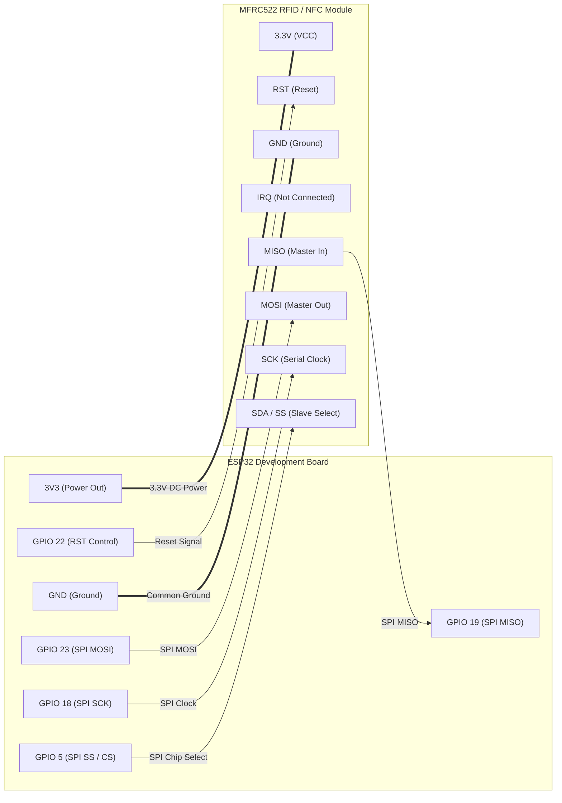
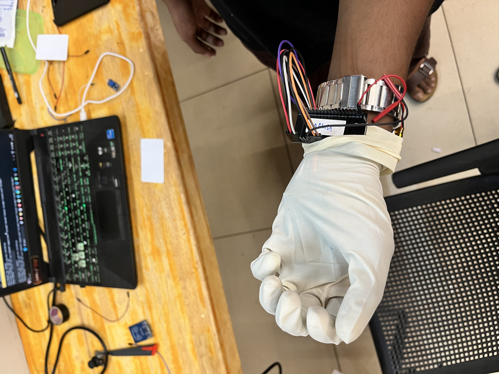
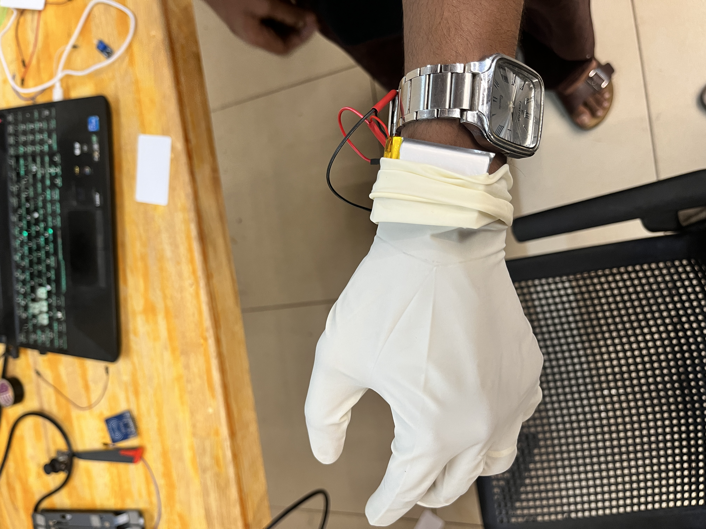
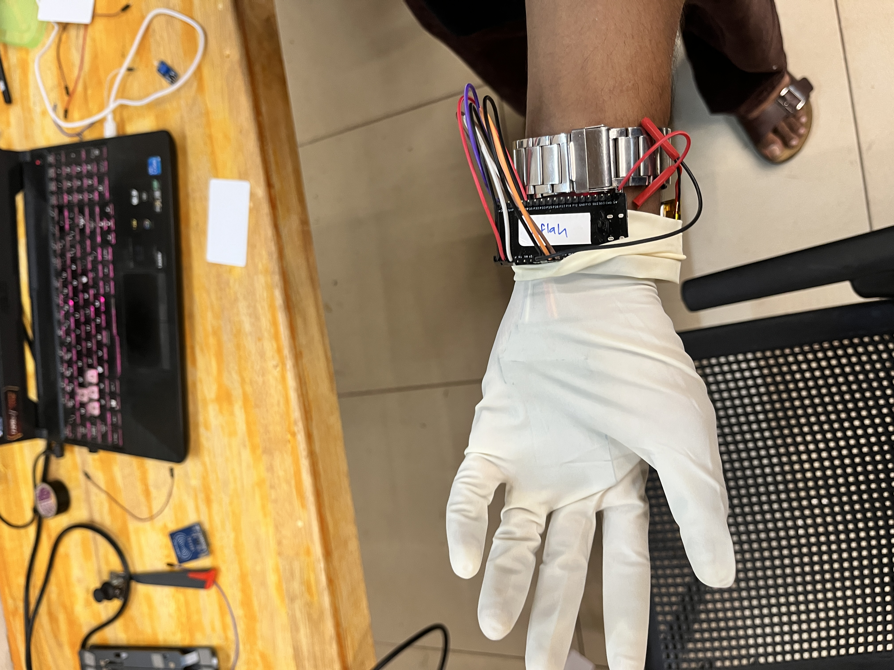
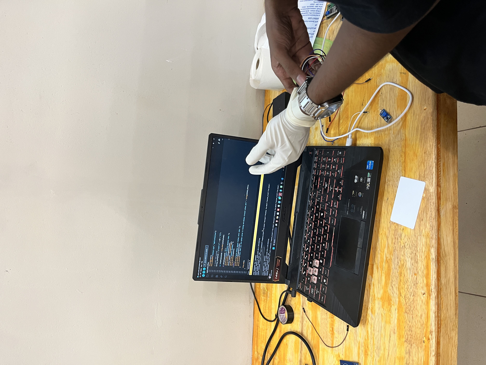

# Meme Glove 🎯

## Basic Details
### Team Name: Solo

### Team Members
- Team Lead: Anurag - Muhammad Abdul Rahman Memorial College Mukkam

### Project Description
An IoT-powered wireless soundboard system using an ESP32 microcontroller and an RC522 RFID/NFC module. Whenever an RFID tag or card is scanned, the ESP32 wirelessly transmits the card's Unique Identifier (UID) over local Wi-Fi to a PC audio server (Python Flask / Node.js Express) to instantly trigger custom songs, meme sound effects, and playback controls.

### The Problem (that doesn't exist)
Having to manually search for meme sound effects, open Spotify, or press hotkeys on your keyboard every time you want dramatic entrance music or punchlines in real-life conversations takes way too much physical effort and completely ruins comedic timing.

### The Solution (that nobody asked for)
An over-engineered wireless NFC/RFID glove system that reads tags tapped on your hands, cards, or keychains and immediately transmits HTTP triggers over Wi-Fi to blast audio directly through your PC speakers with zero mouse clicks.

---

## Technical Details

### Technologies/Components Used

For Software:
- **Languages**: C++ (Arduino ESP32), Python 3, JavaScript (Node.js)
- **Frameworks**: Flask (Python), Express.js (Node.js)
- **Libraries**: `MFRC522`, `WiFi.h`, `HTTPClient.h`, `pygame` (mixer), `sound-play`
- **Tools**: Arduino IDE, Windows Batch Scripts (`.bat`), Git, GitHub CLI

For Hardware:
- **ESP32 NodeMCU Development Board** (2.4 GHz Wi-Fi + Bluetooth, Dual-Core)
- **RC522 RFID / NFC Reader Module** (13.56 MHz SPI interface, 3.3V operating voltage)
- **13.56 MHz RFID / NFC Cards & Keychains** (MIFARE Classic / NTAG)
- **Jumper Wires & Breadboard** (or glove mount)
- **Micro-USB Cable & 5V Power Source**

---

### Hardware Connections (Pinout Table)

| RC522 Pin | ESP32 Pin | Specification / Notes |
| :--- | :--- | :--- |
| **3.3V / VCC** | **3.3V** | ⚠️ **Must use 3.3V power (DO NOT connect to 5V)** |
| **RST** | **GPIO 22** | Reset line |
| **GND** | **GND** | Ground |
| **MISO** | **GPIO 19** | SPI Master In Slave Out |
| **MOSI** | **GPIO 23** | SPI Master Out Slave In |
| **SCK** | **GPIO 18** | SPI Clock |
| **SDA / SS** | **GPIO 5** | SPI Chip Select |

---

### Implementation

#### For Software:

# Installation

**Option A: Python Music Server**
```bash
# Clone the repository
git clone https://github.com/lovhamic/meme-glove.git
cd meme-glove

# Install Python requirements (or use 1-click run_server.bat)
pip install -r server/requirements.txt
```

**Option B: Node.js Music Server**
```bash
# Navigate to Node.js server directory
cd server_node

# Install Node dependencies (or use 1-click run_node_server.bat)
npm install
```

# Run

**1. Start the Server on PC (1-Click Run):**
- **Python Server**: Double-click `run_server.bat`
- **Node.js Server**: Double-click `run_node_server.bat`
*(The batch file will automatically detect and print your local Wi-Fi IP address and start the server on port 5000)*

**2. Flash the ESP32:**
1. Open `esp32/esp32_rc522_wifi.ino` in Arduino IDE.
2. Install the **`MFRC522`** library (*Sketch -> Include Library -> Manage Libraries*).
3. Set your Wi-Fi credentials and PC IP address:
   ```cpp
   const char* WIFI_SSID     = "YOUR_WIFI_SSID";
   const char* WIFI_PASSWORD = "YOUR_WIFI_PASSWORD";
   const char* SERVER_IP     = "192.168.x.x"; // IP shown in server launcher
   const int   SERVER_PORT   = 5000;
   ```
4. Select board **ESP32 Dev Module** and upload.

**3. Configure Card Mappings:**
- Edit `server/config.json` (or `server_node/config.json`) to assign any card UID to an audio file in `music/`:
  ```json
  {
    "tags": {
      "04A1B2C3": "song1.wav",
      "84C3D2E1": "meme_sound.mp3",
      "STOP_CARD_UID": "ACTION:STOP"
    }
  }
  ```

---

### Project Documentation

For Software:

# Screenshots

### 💻 1. Node.js Audio Server Terminal

*Node.js server running in Windows Terminal showing live IP configuration (`192.168.1.138:5000`), real-time NFC card detection (UID: `5342563E`), and automatic trigger of mapped meme audio (`polayadi-mone.mp3`)*

### ⚡ 2. Arduino IDE ESP32 Serial Monitor

*Arduino IDE Serial Monitor displaying real-time detection of RFID cards (UID: `5342563E`, `54253402`), transmission of HTTP POST requests over Wi-Fi, and HTTP 200 responses from the PC server*

# Diagrams

```mermaid
flowchart TD
    A["🏷️ NFC Card / RFID Tag"] -->|13.56 MHz RFID Wave| B["📡 RC522 Reader Module"]
    B -->|SPI Bus (GPIO 5, 18, 19, 23, 22)| C["⚡ ESP32 Microcontroller"]
    C -->|Extracts UID (e.g. '04A1B2C3')| C
    C -->|HTTP POST JSON over Wi-Fi| D["💻 PC Server (Python / Node.js)"]
    D -->|Look up UID in config.json| E{"🔍 Mapped Action?"}
    E -->|Song File (.mp3 / .wav)| F["🔊 Play Audio via Pygame / Windows Media"]
    E -->|Command: ACTION:STOP| G["⏹️ Stop Playback"]
    E -->|Unmapped Card| H["📢 Console Notification + Beep"]
```
*System Architecture: ESP32 + RC522 scans NFC tag -> Sends HTTP POST over Wi-Fi -> Python/Node.js Server matches UID -> PC plays sound*

---

For Hardware:

# Schematic & Circuit

### 📊 Schematic Diagram (Mermaid)



### 🔌 Pin-to-Pin Circuit Schematic (ASCII)

```text
+------------------------------------+             +-----------------------------+
|        ESP32 DEVKIT V1             |             |     RC522 RFID/NFC MODULE   |
|                                    |             |                             |
|                           [3V3] ---|=============|---> [3.3V (VCC)]            |
|                           [GND] ---|=============|---> [GND]                   |
|                        [GPIO 5] ---|------------->---> [SDA / SS]               |
|                       [GPIO 18] ---|------------->---> [SCK]                    |
|                       [GPIO 19] <--|-------------<---| [MISO]                   |
|                       [GPIO 23] ---|------------->---> [MOSI]                   |
|                       [GPIO 22] ---|------------->---> [RST]                    |
|                                    |             |     [IRQ] (Not Connected)   |
+------------------------------------+             +-----------------------------+
```
*Circuit schematic illustrating SPI data bus and 3.3V power rails between ESP32 and RC522*

# Build Photos

### 🧤 1. Wearable Controller & ESP32 Wrist Mount

*ESP32 development board secured with watch-strap mount and jumper wiring routed to the RFID reader inside the glove*

### 🔋 2. Wireless LiPo Power Pack

*Rechargeable lithium battery pack tucked securely under the wrist cuff for completely untethered wireless operation*

### ✋ 3. Front Palm & Sensor Integration

*Glove palm view showing the flexible sensor integration ready for proximity card scanning*

### 💻 4. Complete System Testing & Arduino IDE Flashing

*Live setup testing: ESP32 scanning RFID card on desk, flashing via Arduino IDE, and streaming Wi-Fi audio triggers to the PC*

---

### Project Demo

# Video
[Add your demo video link here]
*Video demonstrating tapping different RFID cards/tags to instantly play corresponding meme songs and audio tracks on the PC*

# Additional Demos
- Web Dashboard accessible at `http://localhost:5000` for live scan history and volume control.

---

## Team Contributions
- **Anurag**: Solo participant — Hardware circuit design, ESP32 firmware development, Python & Node.js backend servers, Windows batch automation, and documentation.

---
Made with ❤️ at TinkerHub Useless Projects 


